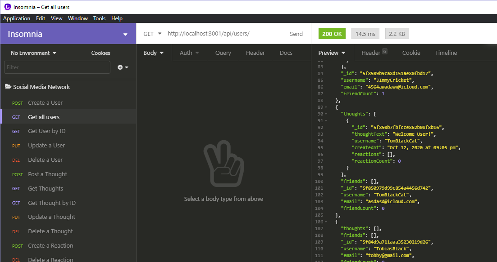
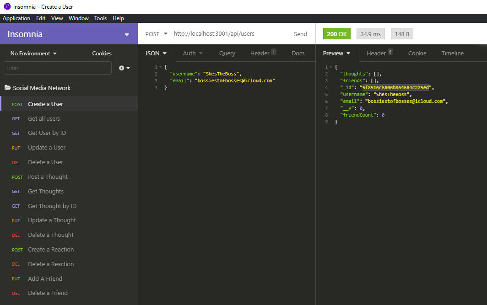
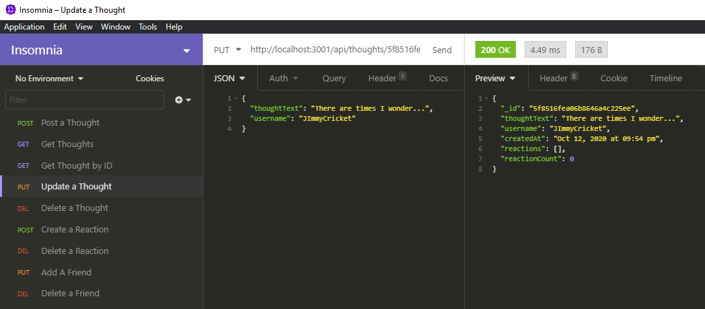

# Social Network API

## Description 
API for a social network web application where users can share their thoughts, react to friends’ thoughts, and create a friend list using Express.js, MongoDB, and Mongoose ODM.

## Table of Contents
- [Social Network API](#social-network-api)
  - [Description](#description)
  - [Table of Contents](#table-of-contents)
  - [Installation](#installation)
  - [Usage](#usage)
  - [License](#license)
  - [Contributing](#contributing)
  - [Resources](#resources)
  - [Questions](#questions)

## Installation 
Begin the usage of this application by downloading or running `git clone <remote link>`. You will need Express.js, MongoDB, and Mongoose for this application to fully work. Be sure MongoDB is already installed before trying to utilize this application. After downloading and extracting the files to a directory of your choice OR using `git clone...` run the installaion by typing `npm install i` in the terminal window. Upon successful installation, you will type `npm start` to spin up the server.

## Usage 
The following video details a visual walk-through of the application API GET/POST/PUT/DELETE routes with Insomnia Core. 

[My Video Walk-Through](https://youtu.be/oOtSZoUPqG4)

Available in HD playback.

Demo Shots:

## License 
This project is covered by the MIT license.

## Contributing 
Contributor Covenant 2.0 available via (https://www.contributor-covenant.org/)

## Resources
* Insomnia Core for RESTful API testing
* [Node.js](https://nodejs.org/en/)
* [Express](https://www.npmjs.com/package/express)
* [Nodemon](https://www.npmjs.com/package/nodemon)
* [Mongoose](https://www.npmjs.com/package/mongoose)

## Questions
Visit my GitHub [Devmadia](https://github.com/Devmadia)

If you have any additional questions not answered here or wish to contact me regarding developments, please email me at 
[thedevmadia@gmail.com](mailto:thedevmadia@gmail.com)